*This project has been created as part of the 42 curriculum by adbourji, mlahrech, atahtah, achakour, aelhaouti.*

# FleetMark

A night-shuttle seat-booking web app. Students sign in with their 42 account, pick their home stop and reserve one seat on tonight's shuttle. Logistics staff plan the schedule and manage the fleet from a dashboard.

> **Status: student project.** FleetMark (codename **SSBS**, Smart School Bus System) was built by five students at 1337 School (Ben Guerir, Morocco) as the team's 42 `ft_transcendence` project. It is a portfolio piece, **not an official 1337 service**. 1337 has since launched its own official platform, built by other students. FleetMark is not affiliated with it and does not replace it.

---

## Contents

- [Demo](#demo)
- [Features](#features)
- [Architecture](#architecture)
- [Tech stack](#tech-stack)
- [Getting started](#getting-started)
- [Troubleshooting](#troubleshooting)
- [Testing](#testing)
- [Project structure](#project-structure)
- [ft_transcendence modules](#ft_transcendence-modules)
- [Security notes](#security-notes)
- [Roadmap and known limits](#roadmap-and-known-limits)
- [Team](#team)

---

## Demo

**Video:** [FleetMark walkthrough, 52 seconds, in French](docs/demo/fleetmark-demo.mp4)

The screenshots below use the French interface. English is one click away.

| | |
|---|---|
| 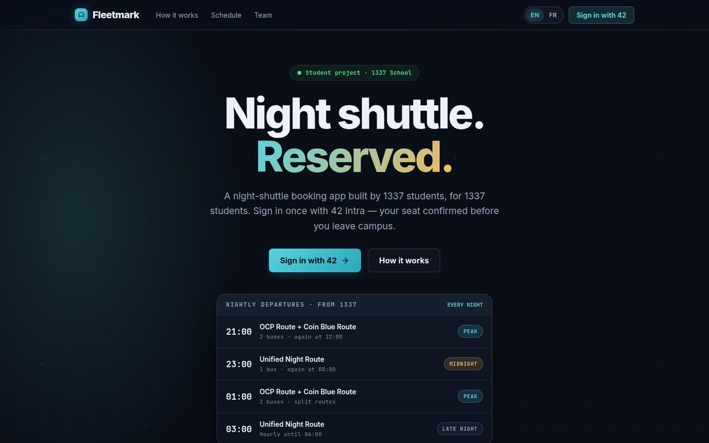<br>Landing page | 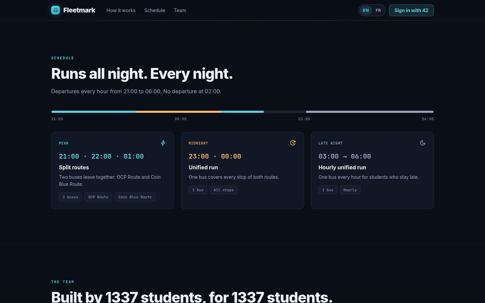<br>Nightly schedule (landing page) |
| 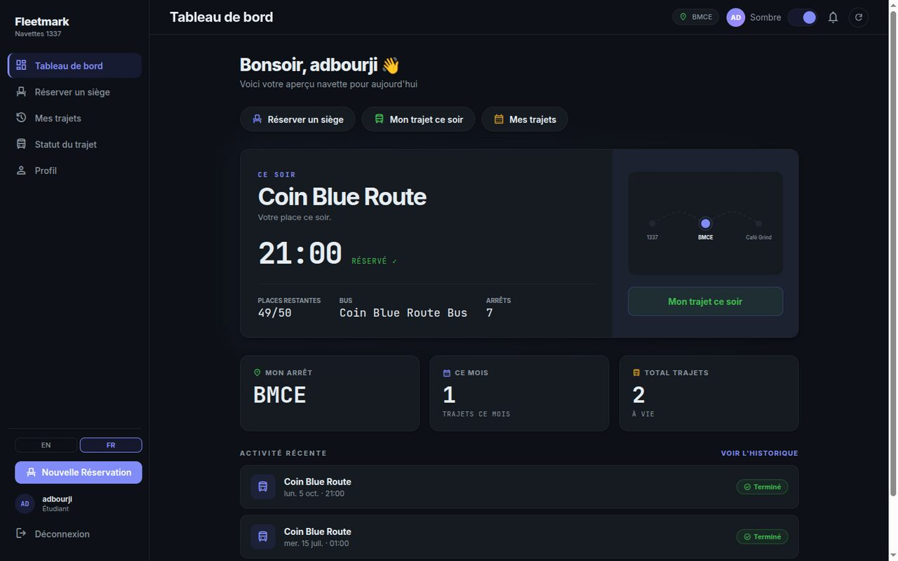<br>Student dashboard | 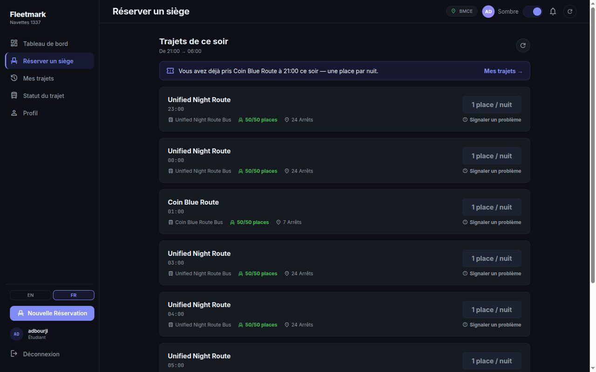<br>Booking a seat |
| 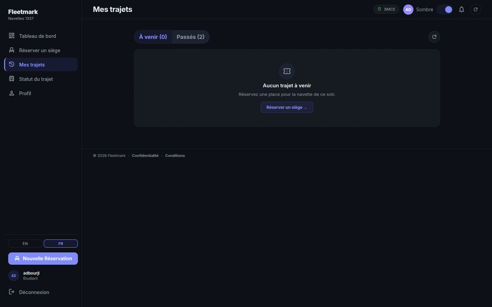<br>My trips | 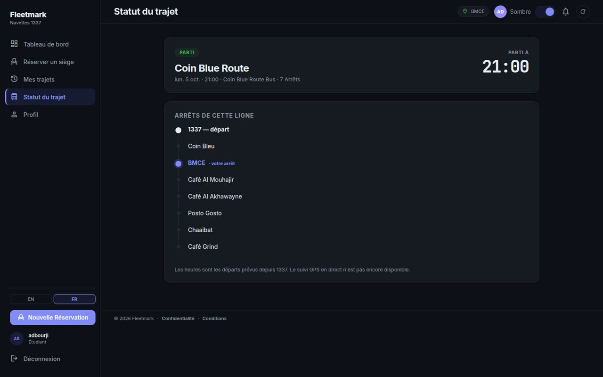<br>Trip status (ordered stops, no GPS) |
| 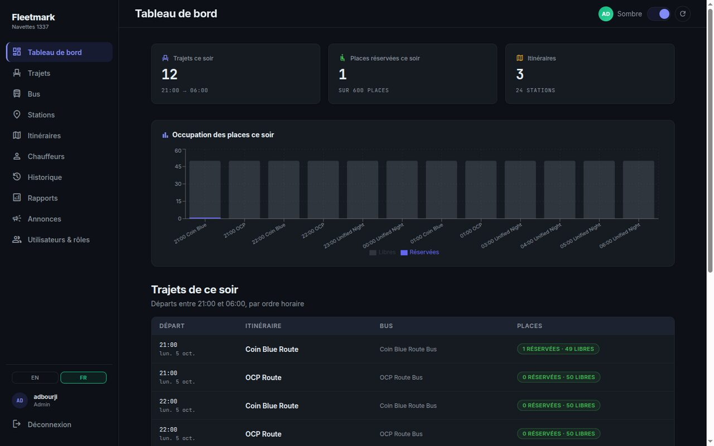<br>Staff night dashboard | 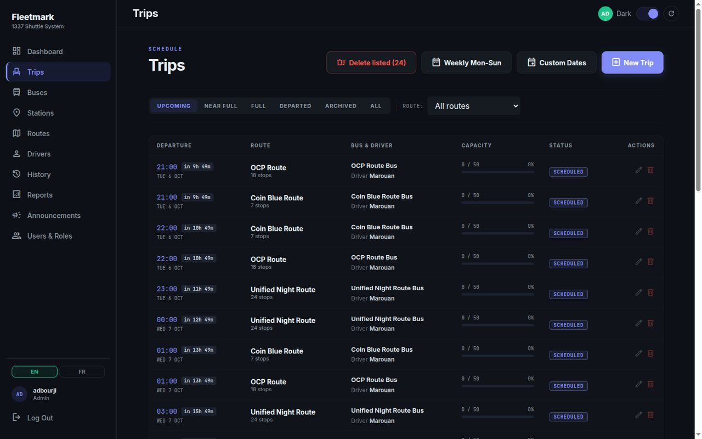<br>Trip management |
| 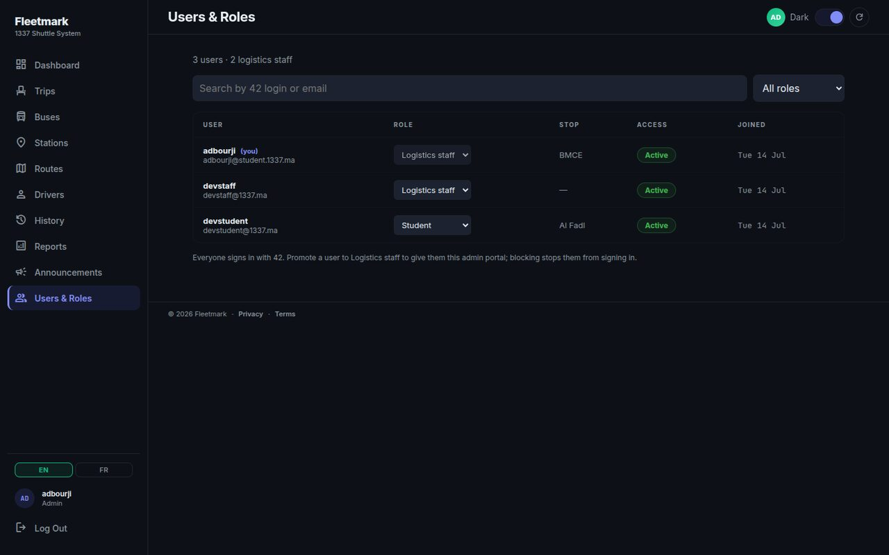<br>Users & Roles | 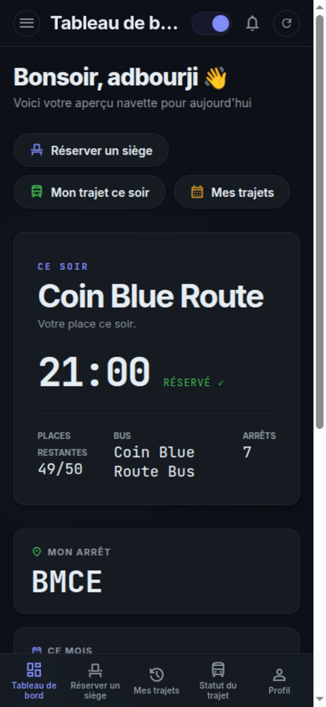<br>Phone layout |

---

## Features

### For students

- **Sign in with 42.** OAuth 2.0 against the 42 Intra API. There are no local passwords.
- **Home stop.** On first login the student picks the stop they get off at. They can change it later in settings.
- **One seat per service night.** A service night runs from 21:00 to 06:00. The schedule generator creates departures at 21:00, 22:00, 23:00, 00:00, 01:00, 03:00, 04:00, 05:00 and 06:00, and the server rejects trips in any other hour. There is no 02:00 departure. The server allows one reservation per student per night and refuses to overbook a bus. The booking runs in a transaction that locks the rows involved, so two requests at the same moment cannot get around these rules.
- **Trips filtered by stop.** Only tonight's upcoming trips whose route serves the student's stop and that still have free seats are listed.
- **Cancel.** A student can cancel a reservation until the trip is archived.
- **Trip status.** Shows the booked trip, its scheduled departure from 1337 and the route's real stops in order, with the student's stop highlighted. **There is no GPS tracking.** The page says so.
- **Announcements.** Staff post announcements with a priority (info, warning or urgent). Students see a badge for unread ones and can dismiss them.
- **Incident reports.** Students can report a problem with a trip: late, no-show, full, accident or breakdown, or other. Staff review the report and mark it resolved.
- **Two-factor authentication.** TOTP (any authenticator app), set up by scanning a QR code. 2FA is **enforced on the server**: after the 42 login, an account with 2FA only gets a 5-minute pre-auth token. It gets no session until it submits a valid code.
- **GDPR self-service.** Download all your personal data as JSON. Deleting the account anonymises your profile (42 login, email, home stop) and deactivates it.
- **English and French**, **dark and light themes**, and a **responsive layout** for phones and desktops.

### For logistics staff

- **Night dashboard.** Tonight's trips, seats booked against capacity, a seat-occupancy bar chart per trip and a reservations-by-route pie chart (Recharts).
- **Trips.** Create, edit and delete trips. You can only archive a trip after it has departed. A weekly or custom-dates **schedule generator** creates a whole night's departures at once. **Bulk delete** removes the trips currently listed and asks you to confirm first. A cron job automatically archives trips that left more than 25 minutes ago and had bookings.
- **Fleet setup.** Buses (seat capacity), stations, routes with an **ordered list of stops**, and drivers (driver passwords are stored hashed).
- **Reservation search** by 42 login and date range.
- **Reports.** Review student incident reports and resolve them.
- **Announcements.** Publish and delete announcements.
- **Users & Roles.** Promote a student to staff, demote staff, block or unblock an account. A blocked user's next API request is refused, and they cannot refresh their session.

### Public REST API

- OpenAPI 3 schema at `/api/schema/`. Interactive docs at [`/api/docs/swagger-ui/`](https://localhost:8443/api/docs/swagger-ui/) and `/api/docs/redoc/`, generated with drf-spectacular.
- An **`X-API-Key`** header gives **read-only** access to `GET /api/v1/stations/`, `/stations/{id}/`, `/routes/` and `/routes/{id}/`. The server compares the key in constant time. Write methods on these resources need a staff JWT. All other endpoints need a logged-in session. See [docs/PUBLIC_API.md](docs/PUBLIC_API.md).

---

## Architecture

The WAF is the only intended entry point: everything goes through `https://localhost:8443`.

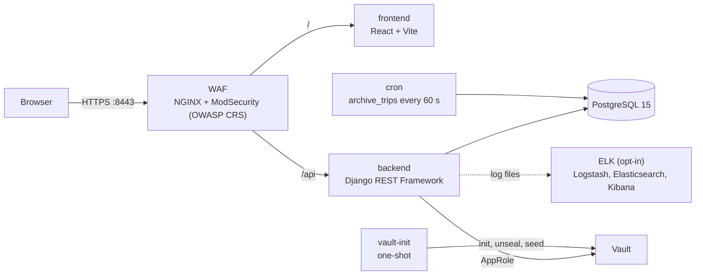

| Service | Image or build | Role |
|---|---|---|
| `waf` | `owasp/modsecurity-crs:nginx-alpine` | TLS termination, reverse proxy, ModSecurity (paranoia level 2) plus custom rules, NGINX rate limiting. Host port **8443**. |
| `frontend` | `node:20-alpine` | React SPA on the Vite dev server (port 5174) |
| `backend` | `./fleetmark/backend` (Python 3.11) | Django REST API. Uses `runserver` when `APP_DEBUG=true` and gunicorn otherwise. |
| `db` | `postgres:15-alpine` | PostgreSQL. Data is kept in `./database/db_data`. |
| `vault` | `hashicorp/vault:1.15` | Secrets store (KV v2, AppRole auth) |
| `vault-init` | `hashicorp/vault:1.15` | One-shot: initialises and unseals Vault, then copies secrets from `.env` into it |
| `cron` | same image as backend | Runs `manage.py archive_trips` in a loop every 60 s |
| `elasticsearch`, `logstash`, `kibana`, `elk-setup`, `elk-cert-init` | Elastic 9.2.3 | **Opt-in** `observability` profile. They are not started by `make up`. |

Detailed diagrams: [docs/diagrams/ARCHITECTURE.md](docs/diagrams/ARCHITECTURE.md) covers the system, the booking workflow, auth and the ERD. The Mermaid sources are in [`docs/diagrams/`](docs/diagrams/).

---

## Tech stack

Versions are the ranges declared in `package.json` and `requirements.txt`. The resolved versions in the current containers are in parentheses.

| Layer | Technology |
|---|---|
| Frontend | React `^19.2.0` (19.2.4), React Router `^7.13.1`, Vite `^7.3.1`, Recharts `^3.8.1`. Custom CSS design system, no UI framework. |
| Frontend tests | Vitest `^3.2.7`, Testing Library, jsdom, ESLint `^9.39.1` |
| Backend | Python 3.11, Django `>=4.2` (5.2), Django REST Framework `>=3.14` (3.18), SimpleJWT `>=5.3`, drf-spectacular `>=0.27`, django-cors-headers, pyotp, qrcode, hvac, gunicorn, WhiteNoise |
| Data | PostgreSQL 15 via the Django ORM (psycopg2) |
| Infrastructure | Docker Compose, NGINX + ModSecurity with OWASP CRS, HashiCorp Vault 1.15, ELK 9.2.3 (optional) |

---

## Getting started

### Prerequisites

- Docker with Compose v2, and `make`
- `openssl` (`make ssl` uses it to generate the self-signed WAF certificate)
- A 42 Intra account so you can register an OAuth application

### 1. Configure

```bash
git clone https://github.com/adi7-x/fleetmark.git
cd fleetmark
cp .env.example .env
```

### 2. Create a 42 OAuth application

1. Go to <https://profile.intra.42.fr/oauth/applications> and create a new application.
2. Set its **redirect URI** to exactly:
   ```
   https://localhost:8443/api/v1/auth/42/callback/
   ```
3. Copy its UID and secret into `.env`:
   ```dotenv
   INTRA_42_CLIENT_ID=<uid>
   INTRA_42_CLIENT_SECRET=<secret>
   ADMIN_42_LOGIN=<your 42 login>   # this login is made staff automatically
   ```

Before running anything beyond local use, also replace the placeholder `POSTGRES_PASSWORD`, `SECRET_KEY` and `SSBS_API_KEY` values.

### 3. Run

```bash
make up
```

This generates the certificate, starts the stack (images are built on the first run) and seeds stations, routes, buses, two demo drivers and tonight's trips.

Open **<https://localhost:8443>** and accept the self-signed certificate warning. Log in with 42. The account named in `ADMIN_42_LOGIN` lands on the staff dashboard. Everyone else starts as a student.

| URL | What |
|---|---|
| `https://localhost:8443` | The app (through the WAF) |
| `https://localhost:8443/api/docs/swagger-ui/` | API docs |
| `https://localhost:5601` | Kibana, only after `make elk-up` (user `elastic`, password `ELASTIC_PASSWORD`) |

### Make targets

| Target | What it does |
|---|---|
| `make up` | Generate the TLS certificate if missing, `docker compose up -d`, wait 10 s, run `seed_data` |
| `make up-build` | Same as above, but rebuilds images and does not seed |
| `make build` | Build all images |
| `make down` | Stop and remove the containers |
| `make restart` | Restart all services |
| `make ssl` | Generate the self-signed WAF certificate (skips it if one exists) |
| `make seed` | Re-run `seed_data` (idempotent) |
| `make migrate` | Run Django migrations (the backend also migrates on start) |
| `make logs`, `logs-backend`, `logs-frontend`, `logs-cron` | Follow logs |
| `make shell-be`, `shell-fe` | Open a shell in the backend or frontend container |
| `make db` | Open `psql` in the database container |
| `make elk-up`, `elk-down` | Start or stop the optional ELK stack (generates its own TLS certificates) |
| `make clean` | **Destructive:** remove containers, volumes, images and `./database/db_data` (uses `sudo`) |
| `make prune` | `docker system prune -f` |
| `make help` | List the targets |

---

## Troubleshooting

**Login with 42 fails with an `invalid_client` error.** 42 application secrets expire. When that happens, you land back on the FleetMark landing page with "42 Intra couldn't complete the sign-in", and `make logs-backend` shows `42 token exchange failed` with `invalid_client` in the response body. Generate a new secret on your 42 application page and put it in `.env` as `INTRA_42_CLIENT_SECRET`. Then apply it as described in the next entry.

**`.env` changes don't take effect.** Secrets are copied into Vault by `vault-init`, and the backend reads its environment when it starts. Recreate the containers involved:

```bash
docker compose up -d --force-recreate vault-init backend cron
docker compose restart waf
```

Restarting the WAF matters. Some NGINX locations resolve the backend hostname only at startup, and the others cache it for 15 s. After the backend is recreated, NGINX can keep using the old container IP, which shows up as **502 Bad Gateway**.

**Browser warning: "Your connection is not private".** This is expected. The certificate is self-signed and generated by `make ssl`. Accept it once for `localhost:8443`, then log in with 42.

**Login redirects to the landing page with an "expired" error.** The OAuth `state` cookie lasts 10 minutes. Start the login again.

---

## Testing

Run these from the repo root while the containers are up:

```bash
# Backend: 86 tests, Django test runner (8 apps)
docker compose exec backend python manage.py test

# Frontend: 23 tests, Vitest + Testing Library (3 files)
docker compose exec frontend npx vitest run

# Lint (0 errors; a few react-hooks warnings remain) and production build
docker compose exec frontend npx eslint src
docker compose exec frontend npx vite build
```

All of the above passed when this README was written. Add `-T` after `exec` when running without a TTY, for example in CI.

---

## Project structure

```
.
├── docker-compose.yml        # all services; ELK sits behind the "observability" profile
├── Makefile
├── .env.example
├── Dockerfile, entrypoint.sh # frontend container
├── waf/                      # NGINX + ModSecurity config, custom rules, cert script
├── vault/                    # Vault config, policy, init/unseal/seed script
├── elk/                      # Logstash pipeline, Elasticsearch/Kibana config, setup scripts
├── docs/
│   ├── PUBLIC_API.md
│   ├── diagrams/             # ARCHITECTURE.md + Mermaid sources
│   ├── screenshots/
│   └── demo/                 # demo video
└── fleetmark/
    ├── README.md             # detailed technical documentation
    ├── backend/              # Django project "ssbs"
    │   ├── ssbs/             # settings, urls, Vault client
    │   └── apps/             # users, stations, buses, routes, drivers,
    │                         # trips, reservations, reports, announcements
    └── frontend/             # React + Vite SPA
        └── src/
            ├── pages/        # passenger/, student/ (onboarding), admin/, driver/, legal/
            ├── components/   # layout/, ui/ (design system)
            ├── context/      # auth, theme, translations (EN/FR)
            └── services/     # API client (in-memory access token)
```

---

## ft_transcendence modules

This is the module list the team claims. The notes describe what the code actually does, so evaluators can judge each module against their version of the subject.

| Module | Type | Implementation | Status |
|---|---|---|---|
| Framework for frontend and backend | Major | React + Django REST Framework | Implemented |
| ORM | Minor | Django ORM on PostgreSQL | Implemented |
| Public API | Major | API key, DRF and NGINX rate limits, OpenAPI docs. The API key only grants **read-only** access to 4 endpoints (stations and routes). Writes need a staff JWT. | **Partial** |
| Announcement / notification system | Minor | Staff announcements with priority, unread badge, per-user dismissal | Implemented |
| Custom design system | Minor | Reusable components in `src/components/ui` and CSS design tokens with dark and light themes | Implemented |
| Multiple languages | Minor | English and French only. The Arabic translation that older docs mentioned has been removed. | **Partial** (2 languages) |
| Standard user management | Major | 42 profile and avatar, home stop, roles (student, staff, driver), staff Users & Roles page, block and unblock | Implemented |
| Remote authentication (OAuth 2.0, 42) | Minor | Authorization-code flow with a `state` cookie for CSRF protection | Implemented |
| Two-factor authentication (TOTP) | Minor | QR setup, enforced on the server at login | Implemented |
| WAF/ModSecurity + Vault | Major | ModSecurity with OWASP CRS in front of everything. Vault with AppRole. | Implemented |
| Log management (ELK) | Major | Logstash → Elasticsearch → Kibana, with TLS and an ILM policy. Opt-in profile. | Implemented |
| GDPR compliance | Minor | Data export, account anonymisation and deactivation, privacy policy and terms pages | Implemented |
| Analytics dashboard (module of choice) | Minor | Staff night dashboard with Recharts bar and pie charts | Implemented |

The team claims **18 points** (5 major and 8 minor modules), against a minimum of 14. If the two modules marked partial are not accepted, the total is **15**.

---

## Security notes

Each item below was checked in the code.

- **WAF.** NGINX + ModSecurity with OWASP CRS, paranoia level 2, inbound anomaly threshold 5. Custom rules block dotfiles, backup files, sensitive paths, scanner user agents, unused HTTP methods and empty `Host` headers. Simple SQL-injection and XSS probes return `403`. TLS 1.2 and 1.3 only, and the WAF sets HSTS and security headers.
- **Secrets in Vault.** `vault-init` copies the secrets from `.env` into Vault KV v2. Django settings read the database credentials and `SECRET_KEY` from Vault through AppRole, and fall back to environment variables. The OAuth views and the API-key check still read their values (`INTRA_42_*`, `ADMIN_42_LOGIN`, `SSBS_API_KEY`) straight from the environment. `vault-init` uses a single unseal key stored on a Docker volume. That is acceptable for local use, not for production.
- **Tokens.** The refresh token (7 days) lives only in an `HttpOnly`, `Secure`, `SameSite=Lax` cookie scoped to `/api/v1/auth/`. The access token (60 min) is kept **in memory** in the SPA and never in `localStorage`. Logout clears the cookie on the server.
- **OAuth CSRF.** `/42/login/` issues a random `state` and stores it in an HttpOnly cookie. The callback rejects a missing or mismatched state, comparing in constant time.
- **2FA on the server.** For a 2FA account, the OAuth callback issues only a 5-minute pre-auth token. No endpoint except `/2fa/login-verify/` accepts it, and that endpoint requires a valid TOTP code.
- **RBAC.** Every view checks permissions (`IsAuthenticated` by default, `IsLogisticsStaff` for admin endpoints). Students only see their own reservations and reports. The user-management API cannot delete users.
- **Rate limits.** DRF throttling: 100 requests/hour anonymous, 1,000/hour per user, 600/hour for token refresh. `NUM_PROXIES=1` stops clients from bypassing the limit with a spoofed `X-Forwarded-For`. NGINX adds `limit_req` on `/api/` (30 req/s per IP, burst 20).
- **Two-factor hardening.** 5 wrong codes lock 2FA on the account for 15 minutes. Each code is accepted only once, ASCII digits only, and a pre-auth token works for a single login. Logout revokes the refresh token (SimpleJWT blacklist), and blocked users cannot refresh.
- **Local-development caveats.** The backend (`8000`), frontend (`5174`) and PostgreSQL (`5433`) ports are published for debugging, but only on `127.0.0.1`. From the network, the only way in is the WAF on `8443`. `.env.example` sets `APP_DEBUG=true`. A real deployment should set `APP_DEBUG=false`, which switches the backend to gunicorn (one process with threads, because the 2FA lockout uses the in-process cache) and turns on Django's HTTPS and HSTS settings.

---

## Roadmap and known limits

These are not implemented yet:

- **Live GPS tracking.** Trip status shows scheduled times and stops only.
- **Driver app.** The `DRIVER` role exists, but `/driver` shows a "coming soon" page. Drivers are fleet records and cannot log in yet.
- **QR boarding pass** to check passengers in on the bus.
- **Booking cutoff before departure.** The student's list hides a trip once it has left. The booking endpoint itself has no cutoff, and it does not reject a departed trip until that trip is archived.
- **No-show handling.** Nothing tracks or penalises reserved seats that go unused.
- **Production deployment.** Only the local Docker Compose setup exists. There is no hosted instance, CI/CD or production hardening.

---

## Team

| Name | Role | Core responsibility |
|---|---|---|
| **Adil Bourji** (`adbourji`) | Product Owner / Frontend Lead | React SPA, custom design system, admin portal, i18n |
| **Mohamed Lahrech** (`mlahrech`) | Tech Lead / Backend | API design, reservation engine, data model |
| **Aamir Tahtah** (`atahtah`) | Project Manager / DevOps | Docker, ELK, WAF |
| **Abderrahman Chakour** (`achakour`) | Backend Developer | 42 OAuth, JWT, HashiCorp Vault |
| **Ayoub El Haouti** (`aelhaouti`) | QA Engineer | Automated tests, OpenAPI docs |

More technical detail (data model, API endpoints, per-member contributions) is in [fleetmark/README.md](fleetmark/README.md).

---

Built at 1337 School, Ben Guerir, Morocco, as part of the 42 curriculum.
