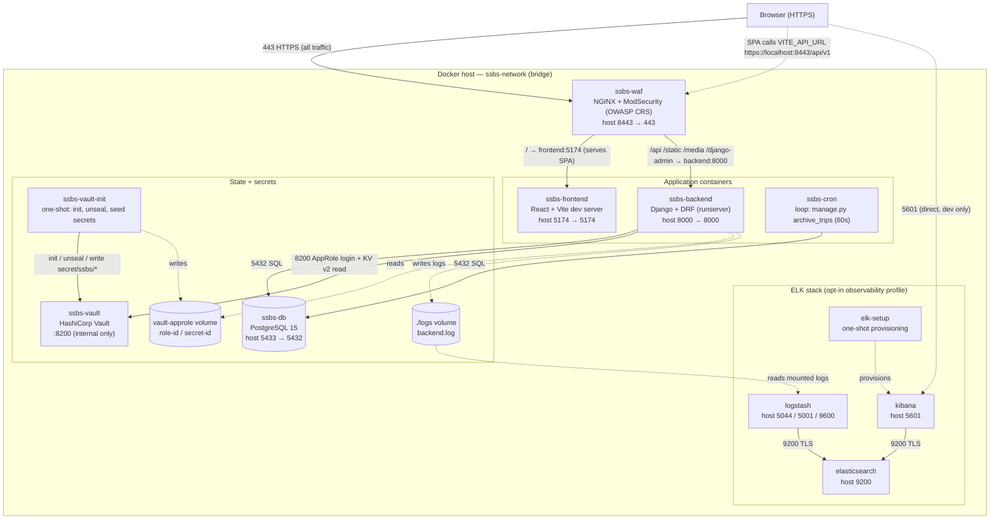
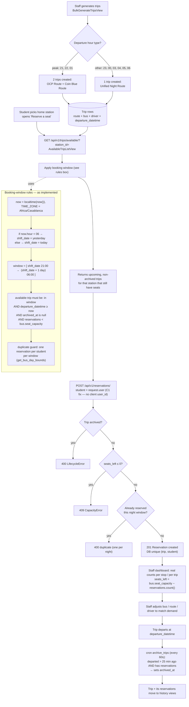
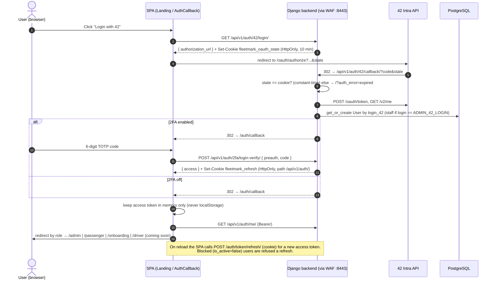
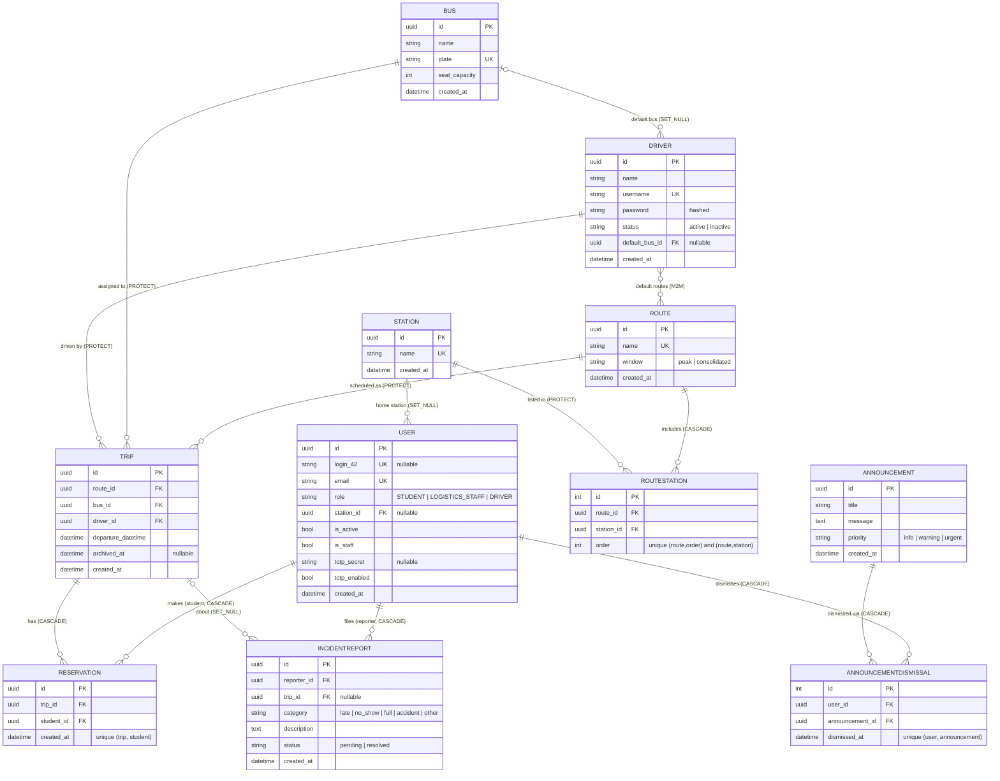

# FLEETMARK / SSBS — Architecture (from the code, not the README)

These diagrams are derived directly from the source, verified file-by-file. Where the running
system differs from what the README claims, the code wins and it is called out below.

Diagram sources live beside this file as `.mmd`:
[system-architecture](system-architecture.mmd) ·
[business-workflow](business-workflow.mmd) ·
[auth-flow](auth-flow.mmd) ·
[erd](erd.mmd)

---

## 1. System architecture

Single public entry point is the WAF on `https://localhost:8443`. NGINX + ModSecurity terminate
TLS and route `/` to the Vite frontend and `/api`, `/static`, `/media`, `/django-admin` to Django.
Django settings read the database credentials and `SECRET_KEY` from Vault over AppRole (credentials handed
to it on a shared volume by the one-shot `vault-init`); the OAuth views and the API-key check still read
their values from the environment. Django writes logs to a file that Logstash tails into Elasticsearch/Kibana.

**Reality notes:** with `APP_DEBUG=true` (the `.env.example` default) the frontend and backend run as
**dev servers** (`vite`, `manage.py runserver`); with `APP_DEBUG=false` the backend switches to gunicorn.
The **ELK stack is opt-in** (`docker compose --profile observability`, or `make elk-up`); its TLS certs are
generated by the `elk-cert-init` container. Kibana's `5601` is published to the host, so it is reached
directly, not through the WAF. Logstash tails the backend log file (`./logs/backend.log`).

---

## 2. Business workflow

Staff pre-generate the night's trips; students book a seat against their home station during the day;
staff see real per-stop demand and reassign buses/routes; a cron archives trips shortly after they run.

**The booking window in plain words:** a "bus day" runs **21:00 → 06:00** the next morning. Any time
from 06:00 onward counts toward *tonight's* window, so a student can book tonight's 01:00 bus at 10:00
in the morning — this is the intended rule (it is what M1 fixed the test to match). Before 06:00 you are
still inside *last night's* window. A student may hold **one reservation per window**, capacity is
`bus.seat_capacity`, and a trip is archived ~25 minutes after it departs (only if it had reservations).

---

## 3. Auth flow

Login is **42 Intra OAuth only**; there is no username/password endpoint. RBAC is enforced per view.
This section reflects the hardened flow (OAuth `state`, server-enforced 2FA, refresh token in an HttpOnly
cookie, access token in memory). *Note: the standalone `auth-flow.mmd` predates these changes; this
section is the current reference.*

**Notes:** the pre-auth token's type (`preauth_2fa`) is not accepted by `JWTAuthentication`, so it cannot
be used as a Bearer token anywhere; only `/2fa/login-verify/` exchanges it. The `X-API-Key` is not a
global default: it is applied only to the read-only station and route endpoints
(`HasAPIKeyOrIsAuthenticated`, see [PUBLIC_API.md](../PUBLIC_API.md)).

---

## 4. Data model / ERD

Ten domain models plus the custom `User`. All primary keys are UUIDs except the two join tables
(`RouteStation`, `AnnouncementDismissal`), which use auto integer PKs. Operational integrity is enforced
with `PROTECT` on `Trip`'s foreign keys (you cannot delete a bus/route/driver still referenced by a trip)
and `CASCADE` on reservations.

**Note on `Driver` vs `User`:** `Driver` is a **fleet record** (with its own `username`/`password` and
`default_bus`/`default_routes`), not a login account. The driver-facing portal is not built yet
(`/driver` renders "Coming Soon"), so those driver credentials are not currently used to authenticate.

---

*Generated from the codebase. If you change the models, the booking window, the WAF routes, or the auth
flow, update the matching `.mmd` file so these stay honest.*
